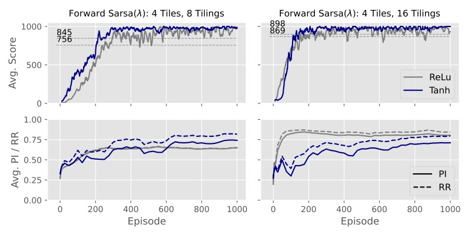

# ReinforcementLearning

This is the repository for my research paper on "_Online, Value-Based Reinforcement Learning with Neural Networks - Advances and Challenges_". The abstract of the paper and some further remarks on the theoretical background and test setting can be found below. Additionally, some empirical results reported in the paper are shown along with some key observations (). 

#### Abstract
> _In any practical domain, reinforcement learning (RL) needs to achieve generalization to navigate large and even infinite, continuous state-spaces. Linear function approximation offers robust theoretical properties to do so and learns well under appropriate feature representations. However, even general representations like Tile Coding rely on prior domain knowledge. In contrast, Neural Networks (NN) have the ability learn suitable representations from the data without prior knowledge as successes in supervised learning have shown. Yet, despite notable successes in combining RL and NN, instabilities and sensitivity to parameter-configurations have repeatedly been found to persist in learning. This study extensively analyzes learning instabilities for online, value-based RL with NN in theory and empirically on the Cart-Pole benchmark. It is shown that blindly following recommendations from the supervised setting is not advisable due to fundamentally different settings for optimization. In contrast to the decorrelated, trustworthy signal under supervised learning, in online RL, optimization needs to deal with non-stationary, biased targets and temporal correlation of the samples. Under these conditions, aggressive learning and generalization can cause catastrophic forgetting and reverse any learning progress. The findings of other authors regarding the impact of the NN-architecture, feature pre-processing, and algorithm are synthesized and presented in a unified view. Central to the analysis of generalization in RL is the neural tangent kernel, which is found to be a fruitful quantity to characterize and measure empirically. The empirical results on the Cart-Pole benchmark largely appear in line with the theoretical characterization and reportings in the literature but also point to some areas where continued research is required._

## Remarks

### Reported Metrics and Theoretical Background
Learning performance is assessed throughout training based on the agent's achieved return per episode. For Cart-Pole, this score directly reflects the number of time-steps the agent is able to balance the pole for and should be equal to the max. episode length for any optimal policy. This score is reported for all training episodes, yielding the learning curves found in the Section . Desirable traits are fast and stable learning, visible in a steep ascent of the learning curve and little noise / fluctuation in performance throughout training. Additionally, a robust learner should be relatively insensitive to settings of hyperparameters, wherefore the sensitivity to values of the decay-rate $\lambda$ and learning-rate $\alpha$ are reported.

The central issue of investigation are instabilities persistent in online, value-based RL when paired with neural networks as non-linear function approximators. In contrast to the linear setting, where convergence proofs exist (e.g., see van Roy & Tsitsiklis, 1997), no general convergence results exist for the non-linear setting. It is found that the neural tangent kernel as characterized by Jacot, Gabriel & Hongler (2018) enables a nice bridge between the linear and non-linear setting. Analyzing the weight update equation in kernelized form as done by Achiam, Knight & Abeel (2020) for the Deep Q-Learning algorithm nicely disentangles the factors involved to analyze where things might go awry. Online RL, one finds, already presents a sub-optimal landscape for gradient descent to operate in due to non-stationary targets (the targets themselves depending on the weight vector), temporal correlation and bias. In the linear setting, where the gradients and generalization behave in a controlled manner, stable learning can be proved and achieved (also see ). In the non-linear setting, generalization behavior depends on the network architecture and is not easily analyzed theoretically. However, the tangent kernel should capture the generalization properties of a network. Evaluating the kernel over a sample of states throughout training should then enable a comparison of architectures. To do so, a random sample of 500 states from the training of a linear agent was used ().

Two metrics, the pairwise interference (PI; Liu, 2019) and the row-ratio (Achiam et al., 2020), are reported and measure the cosine similarity of the gradients, reflected in the off-diagonal elements of the kernel, and the average ratio of the off- to the on-diagonal elements of the kernel. Larger ratios should indicate stronger generalization. In supervised learning, when gradient descent operates on a trustworthy signal, the strong generalization abilities of neural networks, can be very fruitful. ReLu, known to generalize and learn rather aggressively, performs very well under these conditions and has become the default recommendation for supervised learning (see Goodfellow, Bengio & Courville, 2016). However, paired with a non-stationary target, temporal correlation and bias, aggressive generalization can lead to catastrophic interference in online RL as previously characterized for supervised, multi-task learning (see Goodrich, 2015). Heuristic solutions like gradient clipping and decorrelating samples through an experience replay buffer (Lin, 1992) have been found to offer enhanced stability (e.g., see Mnih et al., 2015) but were not investigated in this work. Instead, the impact of the network architecture was investigated by comparing Tanh and ReLu activations, the former featuring bounded gradients in contrast to ReLu. Additionally, discretized representations of the state-space (Tile Coding; Albus, 1975), were compared to simply using the continuous (scaled) state-space variables as inputs following Ghiassian et al. (2020). A more thorough theoretical discussion is given in the paper. Some empirical results on the Cart-Pole benchmark are presented below ().

### Algorithms
**Two algorithms** were tested:
1. **Sarsa($\lambda$) with accumulating traces**, also Accumulate Sarsa($\lambda$) (Sutton, 1988)
2. **Forward Sarsa($\lambda$)** (van Seijen, 2016)

Whereas Accumulate Sarsa($\lambda$) uses eligibility traces to update the weight vector at each step, Forward Sarsa($\lambda$) uses an n-step truncated $\lambda$-return target in its update. Forward Sarsa($\lambda$) has been proposed by van Seijen (2016) to improve on instabilities apparent under Accumulate Sarsa($\lambda$) when paired with non-linear function approximation. In the non-linear setting, Accumulate Sarsa($\lambda$) faces the issue of an excessive accumulation of gradients in the trace as many features tend to be active frequently for neural networks due to strong generalization. This can be shown to produce the issue of a much larger than intended pseudo-learning-rate, causing / aggravating instabilities (see van Seijen et al, 2016). Van Seijen (2016) reports much improved performance of Forward Sarsa($\lambda$) relative to Accumulate Sarsa($\lambda$) when paired with non-linear function approximation. The reported results were reproduced and can be confirmed ().

### Agents
**Three agent classes** are defined in :
1. `LinearSarsaAgent()` (NumPy), `LinearSarsaAgent_V2()` (Tensorflow)
    
    - The feature vector was chosen with dimension $nTilings \times nTilesPerTiling \times numActions$. Hence, state-action pairs were distinguished by shifting the tile-coded state to a distinct region in the feature vector.

2. `MultiNetSarsaAgent()`

    - Agent maintains a separate network for each action, taking a vector of the state-space variables as input and resolving to a single output for the action-value. For Cart-Pole, the agent has one network to predict the action-value 'left' and one to predict 'right' for each state, as reported by van Seijen (2016).
    - Used for all tests of continuous features.

3. `MultiOutput_Discrete_SarsaAgent()`

    - Agent maintains a single network, taking a vector of the tile-coded state-space as input and producing one output node for each possible action. For Cart-Pole, the network outputs two values.

### Tested Configurations
The following agent-algorithm combinations were tested and can be found in the indicated scripts. All neural networks contained a single hidden-layer of 50 units. A detailed listing of all tested hyperparameters can be found below ().
| Agent | Feature Representation | Algorithm | Script |
| --- | --- | --- | --- | 
| `LinearSarsaAgent_V2()` | Tile Coding | Accumulate Sarsa |  |
| `MultiNetSarsaAgent()` | Continuous | Accumulate Sarsa |  |
| `LinearSarsaAgent_V2()` | Tile Coding | Forward Sarsa |  |
| `MultiNetSarsaAgent()` | Continuous | Forward Sarsa |  |
| `MultiOutput_Discrete_SarsaAgent()` | Tile Coding | Forward Sarsa |  |

### Environment

Results are reported for the **Cart-Pole** problem, a simple mechanics problem that tests the agent's ability to **balance a pole attached to a cart by a joint** (Anderson, Barto, Sutton, 1983). The state of the system, as visualized below, is fully described by four continuous environment variables:
- The **position** of the cart on the track: $x$
- item The **velocity** of the cart: $\dot{x}$
- The **angle** of the pole: $\Theta$
- The **angular velocity** of the pole: $\dot{\Theta}$

The **action space is discrete** with actions \{left, right\}, applying a fixed force $F$ to the cart. No friction is involved. The task is episodic with episodes ending if either:
- the pole angle $\Theta$ falls outside the range $[-0.2095, 0.2095]$,
- the cart's position $x$ leaves the range $[-2.4, 2.4]$, or
- the episode length surpasses a pre-defined maximum length. 

The agent receives a reward of $+1$ for each time-step that the pole spends in a non-terminal state. 

  

## Empirical Results

The following graphs display the empirical results reported in the paper for the tested configurations of agents, algorithms and feature representations (see table above) along with some observations. Some remarks on the theoretical background are given () but the full discussion is deferred to the paper, which can be made available upon request.

The tests were conducted in `Python 3.11.2` using the gymnasium library (see ), which provides environment implementations for a range of standard reinforcement learning problems (Towers, 2023). To create the tile-coded features, the open-source implementation of R. Sutton was used, which is available at: <http://incompleteideas.net/tiles/tiles3.html>. The results for the linear models are averaged across three independent trials each, the results for the non-linear models across five independent trials each.

### Linear Models
#### 1. **Finding:** Linear TD-learning displays stable learning under both Accumulate Sarsa($\lambda$) and Forward Sarsa($\lambda$)
- Overall, stable learning for all configurations
- Greater nTiles reduces noise but both perform similarly
-  Increasing nTilings more effective at improving stability than increasing nTiles

<figure align="left">
    
    <figcaption><i>Learning curves for linear Accumulate Sarsa(λ) and linear Forward Sarsa(λ) on Cart-Pole for 1000 episodes (max. episode length: 1000) at optimized α (step-size) and λ (decay-rate). </i></figcaption>
</figure>
&nbsp;

---

#### 2. **Finding:** No issues of greater sensitivity of Accumulate Sarsa($\lambda$) are visible.
- The Pseudo-Learning-Rate issue as characterized by van Seijen et al. (2016) appears to be prevented by sufficient sparsity of the tile-coded feature, avoiding excessive gradient-accumulation for Accumulate Sarsa($\lambda$).
- Accumulate Sarsa($\lambda$) appears even more stable than Forward Sarsa($\lambda$), potentially due to its fully incremental nature compared with the delayed, truncated $\lambda$-return target of Forward Sarsa($\lambda$).

<figure align="center" style="display: table;">
    
    <figcaption style="display: table-caption; caption-side: bottom ;"><i>Sensitivity of linear Accumulate Sarsa(λ) and linear Forward Sarsa(λ) to varying decay-rate λ at optimized α (top row) and varying step-size at optimal λ (bottom row). </i></figcaption>
</figure>
&nbsp;

---

### Non-Linear Models - Cont. Features 

#### 3. **Finding:** Instabilities persist even in best-performing configurations but there are clear differences in performance between network architectures and algorithms.
    
<figure align="left" style="display: table;">
    
    <figcaption style="display: table-caption; caption-side: bottom ;"><i>Learning curves for best-performing configurations with continuous inputs (scaled, no Tile Coding). Strong line shows average across 5 trials (smoothing with window size 10), weak lines show individual trials. </i></figcaption>
</figure>
&nbsp;

---

#### 4. **Finding:** Tanh outperforms ReLu by far, displaying much more stable learning overall
- ReLu consistently displays much higher values of PI and much greater learning instabilities
- For Tanh, Forward Sarsa($\lambda$) performs better than Accumulate Sarsa($\lambda$) despite higher PI
- RR less clearly interpretable}, especially for FS($\lambda$)
- Unrecoverable, catastrophic forgetting apparent for ReLu networks (see top row of second figure below: two examples highlighted in purple)
    
<figure align="left" style="display: table;">
    
    <figcaption style="display: table-caption; caption-side: bottom ;"><i>Average score (top row) and interference metrics (bottom row) on Cart-Pole for best-performing ReLu and Tanh configurations. </i></figcaption>
</figure>
&nbsp;

<figure align="left" style="display: table;">
    
    <figcaption style="display: table-caption; caption-side: bottom ;"><i>Forward Sarsa learning curves with varying maximum episode lengths and comparing ReLu and Tanh activations, all else equal. Purple highlighted learning curves in upper row show trials where catastrophic forgetting is apparent. </i></figcaption>
</figure>
&nbsp;

---

#### 5. **Finding:** Forward Sarsa($\lambda$) offers a more robust update target than Accumulate Sarsa($\lambda$) for the non-linear setting
- Forward Sarsa(λ) outperforms Accumulate Sarsa(λ) for λ > 0 with a widening gap
- Pseudo-learning-rate issue (van Seijen et al., 2016) pronounced for Accumulate Sarsa(λ), causing a steady deterioration in performance for growing λ
- Both show drop at λ = 1, in line with characterization of MC-return.
- Forward Sarsa(λ) less sensitive to α

<figure align="left" style="display: table;">
    
    <figcaption style="display: table-caption; caption-side: bottom ;"><i>Sensitivity of average score on Cart-Pole to values of λ at optimized α (top row) and to values of α at optimized λ. Maximum episode length of 1000 steps. </i></figcaption>
</figure>
&nbsp;

---

### Non-Linear Models - Tile-coded Features

#### 6. **Finding:** Much improved stability under tile-coded features both for Tanh and ReLu
- Tanh remains noticeably less noisy than ReLu despite much narrower performance gap
- Greater nTilings appears to improve stability like in linear setting
- Significantly lower PI and RR at initialization compared to continuous features. Metrics evolve much differently compared to case of continuous features, climbing up to a plateau largely in sync with the learning curve.
- In addition to the levels of the interference metrics, which are similar to the ones seen for continuous inputs, it should be considered _how_ generalization occurs. When visualizing the hidden-layer activations (see e.g., Ghiassian et al., 2020), tile-coded features show much improved locality of the learned representations, allowing the model to discriminate more finely. 

<figure align="left" style="display: table;">
    
    <figcaption style="display: table-caption; caption-side: bottom ;"><i>Learning curves and interference metrics for best-performing configurations of ReLu and Tanh networks using tile-coded features. </i></figcaption>
</figure>

---

### Tested Hyperparameters

| Model, (hidden layer size, Arch.) | Method | $\alpha$ (= $2^{-x}$), optim. |  $\lambda$ |  $\gamma$ | activ. func. | $\eta$ (only Forw. Sarsa) | $\epsilon$ (const.) | input scaling | tiles / tilings |
| --- | --- | --- | --- | --- | --- | --- | --- | --- | --- | 
| Linear | Acc. Sarsa($\lambda$) | {2, $\ldots$, 10, 12}, SGD | {0, 0.3, 0.6, 0.9, 1} | 1 | n.a. | n.a. | 0.05 | Min-Max | {4, 8} / 12 | 
| Linear | Forw. Sarsa($\lambda$) | {2, $\ldots$, 10, 12}, SGD | {0, 0.3, 0.6, 0.9, 1} | 1 | n.a. | 0.01 | 0.05 | Min-Max | {4, 8} / {8, 16} | 
| NN, cont., 50, one net/action (single output node) | Acc. & Forw. Sarsa($\lambda$) | {4, $\ldots$, 8}, Adam ($\beta_1=0.9$, $\beta_2=0.99$) | {0, 0.3, 0.6, 0.9, 1} | 1 | {ReLu, Tanh} | 0.01 | 0.05 | {Min-Max, Stand.} | n.a. | 
| NN, tile-coded, 50, single net w. one output/action | Acc. & Forw. Sarsa($\lambda$) | {4, $\ldots$, 8}, Adam ($\beta_1=0.9$, $\beta_2=0.99$) | {0, 0.3, 0.6, 0.9, 1} | 1 | {ReLu, Tanh} | 0.01 | 0.05 | Min-Max | 4 / {8, 16} | 

## References

- Achiam, J., Knight, E., & Abbeel, P. (2019). Towards characterizing divergence in deep q-learning. arXiv: 1903.08894 [cs.LG]
- Albus, J. (1975). New approach to manipulator control: The cerebellar model articulation controller (cmac)1. Retrieved from https://tsapps.nist.gov/publication/get pdf.cfm?pub id=820151
- Ghiassian, S., Rafiee, B., Lo, Y. L., & White, A. (2020). Improving performance in reinforcement learning by breaking generalization in neural networks. arXiv: 2003.07417 [cs.LG]
- Goodfellow, I., Bengio, Y., & Courville, A. (2016). Deep learning. http://www.deeplearningbook.org. MIT Press.
- Goodrich, B. F. (2015). Neuron clustering for mitigating catastrophic forgetting in supervised and reinforcement learning. (Doctoral dissertation, University of Tennessee). Retrieved from https://trace.tennessee.edu/utk_graddiss/3581
- Jacot, A., Gabriel, F., & Hongler, C. (2020). Neural tangent kernel: Convergence and generalization in neural networks. arXiv: 1806.07572 [cs.LG]
- Sutton, R. S. (1988). Learning to predict by the methods of temporal differences. 3(1). doi:10.1023/A:1022633531479
- Lin, L. (1992). Self-improving reactive agents based on reinforcement learning, planning and teaching. Machine Learning, 8, 293–321
- Liu, V. (2019). Sparse representation neural networks for online reinforcement learning. University of Alberta.
- Mnih, V., Kavukcuoglu, K., Silver, D., Rusu, A. A., Veness, J., Bellemare, M. G., . . . Hassabis, D. (2015). Human-level control through deep reinforcement learning. Nature, 518 (7540), 529–533. doi:10.1038/nature14236
- Towers, M., Terry, J. K., Kwiatkowski, A., Balis, J. U., Cola, G. d., Deleu, T., . . . Younis, O. G. (2023, March). Gymnasium. doi:10.5281/zenodo.8127026
- van Seijen, H. (2016). Effective multi-step temporal-difference learning for non-linear function approximation. arXiv: 1608.05151 [cs.AI]
- van Seijen, H., Mahmood, A. R., Pilarski, P. M., Machado, M. C., & Sutton, R. S. (2016). True online temporal-difference learning. arXiv: 1512.04087 [cs.AI]
